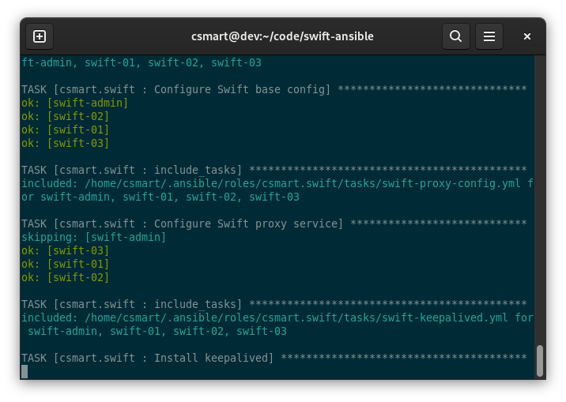

<!-- vim-markdown-toc GFM -->

* [Multi-node Swift Cluster](#multi-node-swift-cluster)
	* [Supported features](#supported-features)
	* [Inventory](#inventory)
	* [Requirements](#requirements)
		* [Supported operating systems](#supported-operating-systems)
			* [Switching from CentOS 8 to Stream](#switching-from-centos-8-to-stream)
		* [SELinux](#selinux)
	* [Deploy Swift cluster](#deploy-swift-cluster)
	* [Modify the Swift cluster](#modify-the-swift-cluster)
	* [Test Swift cluster](#test-swift-cluster)
		* [Benchmark](#benchmark)
	* [Administer cluster](#administer-cluster)
		* [Print current state of object ring](#print-current-state-of-object-ring)
		* [Show dispersion of the object ring](#show-dispersion-of-the-object-ring)
		* [Check the replication status](#check-the-replication-status)
		* [Dispersion and reports](#dispersion-and-reports)
		* [Rebalance ring](#rebalance-ring)
			* [Checking rebalance status](#checking-rebalance-status)
			* [Distribute the rings](#distribute-the-rings)
			* [Check replication status](#check-replication-status)

<!-- vim-markdown-toc -->
# Multi-node Swift Cluster

This is an example inventory and set of playbooks for my `csmart.swift` OpenStack Swift Ansible role (https://github.com/csmart/ansible-role-swift).

It requires at least four CentOS 8 Stream nodes (three PACO nodes and one admin node), each with at least one routable network interface (multiple is supported).
Simply modify the inventory to suit your configuration and run `./scripts/site.sh`.



Here is [an SVG demo](https://raw.githubusercontent.com/csmart/swift-ansible/master/demo.svg), if you want to see it in action.

## Supported features

The Swift Ansible role is able to perform tasks such as:

  - Prepare Swift nodes, including setting SELinux and ensuring SSH access
  - Add repositories and install packages (upstream RDO at the moment)
  - Configure dependent services, such as logging, rsyncd and memcached
  - Configure and enable TLS proxy for Proxy nodes
  - Configure keepalived for failover of proxy VIPs
  - Configure Swift PACO services
  - Create initial account, container and object rings
  - Prepare disks on each node, format and mount according to the rings
  - Build and distribute the rings
  - Configure dispersion
  - Simple operational tasks such as:
    - Add new disks
    - Update and distribute the rings
    - Re-configure PACO services
    - Generate dispersion and replication reports

## Inventory

The inventory is broken out into multiple files under `./inventory` directory.

 - `swift.yml` - defining the settings for Swift nodes

## Requirements

The Ansible deploy host requires:

 - Ansible >= 2.9
 - Jinja2 >= 2.8
 - Python netaddr

The Python netaddr package will be automatically installed on the host that runs Ansible, if using `./scripts/site.sh`.

---
**NOTE**

If your deploy host is CentOS 7, standard Python 2 packages are not sufficient as Jinja2 is 2.7, therefore it is recommended to use Python 3 packages.

```bash
sudo yum install centos-release-ansible-29
sudo yum install ansible-python3 python36-netaddr
```

This is taken care of automatically when using the `./scripts/site.sh` wrapper script.

### Supported operating systems

For the Swift cluster nodes, only CentOS 8 Stream is currently supported.
The role will take care of repositories, dependencies, packages and configuration.

#### Switching from CentOS 8 to Stream

If you are using existing nodes that are CentOS 8, you can switch them to Stream like so.

```
sudo dnf swap centos-linux-repos centos-stream-repos
sudo dnf distro-sync
sudo reboot
```

### SELinux

SELinux will be set to `permissive` mode on the Swift nodes for now, `enforcing` will be supported later.

## Deploy Swift cluster

Once you have some machines ready, modify the inventory file (or create your own) to suit your configuration.
Then we can deploy a multi-node PACO Swift cluster.

This script will wrap the `csmart.swift` Ansible role to bootstrap the Swift cluster.

```bash
./scripts/site.sh
```

This is the same as running the playbook directly.

```bash
ansible-playbook -i ./inventory ./ansible/site.yml
```

## Modify the Swift cluster

As Ansible is idempotent, you can simply modify the inventory and re-run the same full `site.sh` script.

However, rather than running everything you can:

 - Run site playbook with tags to run specific tasks, or
 - Run task specific playbook

For example, if you have modified the Swift Proxy service, you can run the site playbook with tags.

```bash
./scripts/site.sh --tags proxy
```

This is the same as running the playbook directly.

```bash
ansible-playbook -i ./inventory ./ansible/site.yml --tags proxy
```

Or you can run the proxy specific playbook.

```bash
ansible-playbook -i ./inventory ./ansible/swift-proxy-configure.yml
```

## Test Swift cluster

Once the cluster is built, we can perform a simple test to make sure Swift is working.
This script will simply create a container, upload a new temp file, download the object and clean up.

*NOTE:* We're using `tempauth` for authentication using accounts configured in teh role

The first argument can be used to specify the Swift proxy endpoint, adjust as necessary.

```bash
./scripts/test-swift.sh 203.0.113.111
```

You can also test manually, but first we need to export Swift variables to access cluster.

```
export VIP=203.0.113.111
export ST_AUTH=https://${VIP}/auth/v1.0
export ST_KEY="testing"
export ST_USER="test:tester"
```

Create a test file.

```bash
dd if=/dev/urandom of=test.file bs=1M count=10
```

Create a container, upload file and list objects.

*NOTE:* We're using `--insecure` as by default Swift is running with a self-signed cert.

```bash
swift --insecure post test-container
swift --insecure upload test-container test.file
swift --insecure list test-container
swift --insecure delete test-container
```

### Benchmark

We can use the handy [`ossperf` script](https://github.com/christianbaun/ossperf) to upload batches of different sized files.

```bash
git clone https://github.com/christianbaun/ossperf.git
cd ossperf
```

Here is an example uploading 10 x 16MB objects in parallel.

```bash
./ossperf.sh -n 10 -s 16777216 -a -p
```

It should print a summary for you, something like this:

```
[1] Required time to create the bucket:                 0.359 s
[2] Required time to upload the files:                  1.403 s
[3] Required time to fetch a list of files:             0.359 s
[4] Required time to download the files:                0.758 s
[5] Required time to erase the objects:                 0.534 s
[6] Required time to erase the bucket:                  0.403 s
    Required time to perform all S3-related operations: 3.816 s

    Bandwidth during the upload of the files:           956.648 Mbps
    Bandwidth during the download of the files:         1770.682 Mbps
```

## Administer cluster

Once you have a cluster set up, you can use the standard tools to manage your cluster.

The `swift-admin` box is designed to be the point of administration and is where the ring builder files are.

So first, SSH to the swift-admin bnox and switch to root.

```bash
ssh swift-admin
sudo -i
```

### Print current state of object ring

```bash
swift-ring-builder /etc/swift/object.builder
```

### Show dispersion of the object ring

```bash
swift-ring-builder /etc/swift/object.builder dispersion -v
```

### Check the replication status

```bash
swift-recon -r -v
```

### Dispersion and reports

The Ansible code will automatically create containers and place objects around the cluster to tell us how balanced it is, using the `swift-dispersion-populate` tool.

You can see a report of the dispersion.

```bash
swift-dispersion-report
```

### Rebalance ring

```bash
swift-ring-builder /etc/swift/object.builder rebalance
```

To reset min part hours on a ring, so you can force a rebalance.

```bash
swift-ring-builder /etc/swift/object.builder pretend_min_part_hours_passed
```

#### Checking rebalance status

After rebalance but before pushing the new ring, check expected dispersion report which will show a percentage of objects not found (out of place).

```bash
swift-dispersion-report
```

This should return a result something like this, which shows the cluster is 15.39% unbalanced.

```
Using storage policy: Policy-0
100.00% of container copies found (30 of 30)
Queried 1310 objects for dispersion reporting, 3s, 0 retries
There were 605 partitions missing 1 copy.
84.61% of object copies found (3325 of 3930)
Sample represents 1.00% of the object partition space
```

#### Distribute the rings

We can run an Ansible playbook to distribute the rings to the nodes in the cluster.

```bash
ansible-playbook -i ./inventory ./ansible/swift-rings-distribute.yml
```

#### Check replication status

After pushing the new ring, replication should automatically kick in.
Remember that replication occurs in cycles, so it will take a few cycles to move all of the data if the change is large.

We can use recon to check the replication stats which will show successful and failed replication attempts.

```bash
swift-recon -r -v
```

This should should something like this, which has some failures.

```
===============================================================================
--> Starting reconnaissance on 3 hosts (object)
===============================================================================
[2021-09-02 11:08:57] Checking on replication
-> http://198.51.100.12:6200/recon/replication/object: {'replication_time': 2.7121330817540485, 'replication_stats': {'attempted': 1559, 'failure': 11, 'failure_nodes': {'198.51.100.11': {'sde': 2, 'sdg': 3}, '198.51.100.13': {'sde': 1, 'sdf': 1, 'sdg': 4}}, 'hashmatch': 2491, 'remove': 203, 'rsync': 871, 'success': 3310, 'suffix_count': 1317, 'suffix_hash': 224, 'suffix_sync': 139}, 'replication_last': 1630580895.0366092, 'object_replication_time': 2.7121330817540485, 'object_replication_last': 1630580895.0366092}
-> http://198.51.100.11:6200/recon/replication/object: {'replication_time': 2.8767274260520934, 'replication_stats': {'attempted': 1510, 'failure': 10, 'failure_nodes': {'198.51.100.12': {'sde': 1, 'sdf': 2, 'sdg': 2}, '198.51.100.13': {'sde': 1, 'sdf': 3, 'sdg': 1}}, 'hashmatch': 2328, 'remove': 200, 'rsync': 942, 'success': 3210, 'suffix_count': 1262, 'suffix_hash': 139, 'suffix_sync': 193}, 'replication_last': 1630580877.1862817, 'object_replication_time': 2.8767274260520934, 'object_replication_last': 1630580877.1862817}
-> http://198.51.100.13:6200/recon/replication/object: {'replication_time': 2.904825290044149, 'replication_stats': {'attempted': 1507, 'failure': 5, 'failure_nodes': {'198.51.100.12': {'sdf': 3, 'sdg': 2}}, 'hashmatch': 2320, 'remove': 203, 'rsync': 947, 'success': 3212, 'suffix_count': 1257, 'suffix_hash': 136, 'suffix_sync': 189}, 'replication_last': 1630580878.250856, 'object_replication_time': 2.904825290044149, 'object_replication_last': 1630580878.250856}
[replication_time] low: 2, high: 2, avg: 2.8, total: 8, Failed: 0.0%, no_result: 0, reported: 3
[replication_failure] low: 5, high: 11, avg: 8.7, total: 26, Failed: 0.0%, no_result: 0, reported: 3
[replication_success] low: 3210, high: 3310, avg: 3244.0, total: 9732, Failed: 0.0%, no_result: 0, reported: 3
[replication_attempted] low: 1507, high: 1559, avg: 1525.3, total: 4576, Failed: 0.0%, no_result: 0, reported: 3
Oldest completion was 2021-09-02 11:07:57 (1 minutes ago) by 198.51.100.11:6200.
Most recent completion was 2021-09-02 11:08:15 (42 seconds ago) by 198.51.100.12:6200.
===============================================================================
```

The number of `failure`, `remove` and `rsync` will go down slowly as it keeps replicating towards zero, after which replication is complete.

```
===============================================================================
--> Starting reconnaissance on 3 hosts (object)
===============================================================================
[2021-09-02 11:09:31] Checking on replication
-> http://198.51.100.13:6200/recon/replication/object: {'replication_time': 0.6996603449185689, 'replication_stats': {'attempted': 1557, 'failure': 0, 'hashmatch': 3014, 'remove': 46, 'rsync': 150, 'success': 3160, 'suffix_count': 1510, 'suffix_hash': 122, 'suffix_sync': 0}, 'replication_last': 1630580950.253425, 'object_replication_time': 0.6996603449185689, 'object_replication_last': 1630580950.253425}
-> http://198.51.100.11:6200/recon/replication/object: {'replication_time': 0.7066259185473124, 'replication_stats': {'attempted': 1557, 'failure': 0, 'hashmatch': 3013, 'remove': 47, 'rsync': 151, 'success': 3161, 'suffix_count': 1510, 'suffix_hash': 119, 'suffix_sync': 1}, 'replication_last': 1630580949.6139379, 'object_replication_time': 0.7066259185473124, 'object_replication_last': 1630580949.6139379}
-> http://198.51.100.12:6200/recon/replication/object: {'replication_time': 0.6066042462984721, 'replication_stats': {'attempted': 1548, 'failure': 0, 'hashmatch': 3014, 'remove': 38, 'rsync': 123, 'success': 3134, 'suffix_count': 1510, 'suffix_hash': 74, 'suffix_sync': 0}, 'replication_last': 1630580961.4639528, 'object_replication_time': 0.6066042462984721, 'object_replication_last': 1630580961.4639528}
[replication_time] low: 0, high: 0, avg: 0.7, total: 2, Failed: 0.0%, no_result: 0, reported: 3
[replication_failure] low: 0, high: 0, avg: 0.0, total: 0, Failed: 0.0%, no_result: 0, reported: 3
[replication_success] low: 3134, high: 3161, avg: 3151.7, total: 9455, Failed: 0.0%, no_result: 0, reported: 3
[replication_attempted] low: 1548, high: 1557, avg: 1554.0, total: 4662, Failed: 0.0%, no_result: 0, reported: 3
Oldest completion was 2021-09-02 11:09:09 (21 seconds ago) by 198.51.100.11:6200.
Most recent completion was 2021-09-02 11:09:21 (9 seconds ago) by 198.51.100.12:6200.
===============================================================================

```

Once recon is showing zero for `failure`, `remove` and `rsync`, the dispersion report should now show that 100% of objects are found.

```bash
swift-dispersion-report
```

Here's an example.

```
Using storage policy: Policy-0
Queried 10 containers for dispersion reporting, 0s, 0 retries
100.00% of container copies found (30 of 30)
Sample represents 0.98% of the container partition space
Queried 1310 objects for dispersion reporting, 3s, 0 retries
There were 1310 partitions missing 0 copies.
100.00% of object copies found (3930 of 3930)
Sample represents 1.00% of the object partition space
```

Now you can modify, rebalance and push the ring again!
